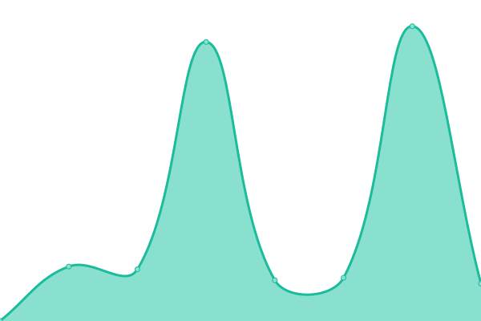

# [📈 Live Status](https://xFuture603.github.io/check_my_websites): <!--live status--> **🟩 All systems operational**

This repository contains the open-source uptime monitor and status page for [Daniel](https://www.xfuture-blog.com/), powered by [Upptime](https://github.com/upptime/upptime).

With [Upptime](https://upptime.js.org), you can get your own unlimited and free uptime monitor and status page, powered entirely by a GitHub repository. We use [Issues](https://github.com/xFuture603/check_my_websites/issues) as incident reports, [Actions](https://github.com/xFuture603/check_my_websites/actions) as uptime monitors, and [Pages](https://xFuture603.github.io/check_my_websites) for the status page.

<!--start: status pages-->
<!-- This summary is generated by Upptime (https://github.com/upptime/upptime) -->
<!-- Do not edit this manually, your changes will be overwritten -->
<!-- prettier-ignore -->
| URL | Status | History | Response Time | Uptime |
| --- | ------ | ------- | ------------- | ------ |
|  xFuture's blog | 🟩 Up | [x-future-s-blog.yml](https://github.com/xFuture603/check_my_websites/commits/master/history/x-future-s-blog.yml) | 

 1518ms
     
 | 

<a href="https://xFuture603.github.io/check_my_websites/history/x-future-s-blog">100.00%</a>
    

|  xFuture's cloud | 🟩 Up | [x-future-s-cloud.yml](https://github.com/xFuture603/check_my_websites/commits/master/history/x-future-s-cloud.yml) | 

 826ms
     
 | 

<a href="https://xFuture603.github.io/check_my_websites/history/x-future-s-cloud">100.00%</a>
    

<!--end: status pages-->

[**Visit our status website →**](https://xFuture603.github.io/check_my_websites)

## 📄 License

- Powered by: [Upptime](https://github.com/upptime/upptime)
- Code: [MIT](./LICENSE) © [Daniel](https://www.xfuture-blog.com/)
- Data in the `./history` directory: [Open Database License](https://opendatacommons.org/licenses/odbl/1-0/)
